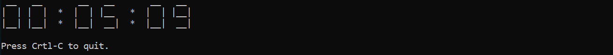
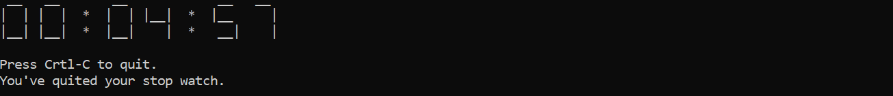

# StopWatch

## Description
This program displays a digital timer that counts down to zero. Instead of rendering numeric characters, it supports a seven-segment display, just like in digital clocks. Users can enter the starting countdown time and quick the program anytime in the middle.

## Prerequisite
No prerequisite needed :)

## How to run
Simply run ```python stop_watch.py```

## Program in Action
When you run the program, it would look like this:


Quit program:

